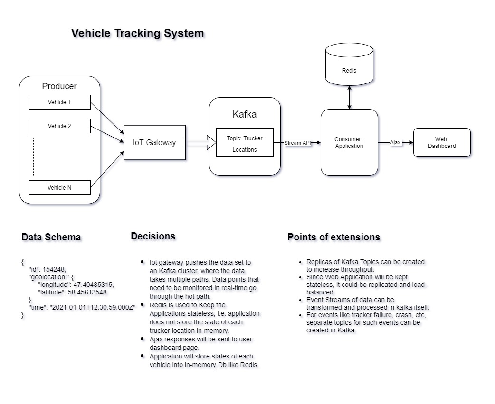

##Vehicle Tracking System
The goal of this assignment is to find out how you, as a Full Stack Engineer, handle a scenario with the constraints and vagueness of the real world. We expect you to make a variety of assumptions given the information you have, and to clearly document them in the README, use a diagram software like draw.io to lay down the architecture plan of each building block of the software. The diagram will help us understand how you envision the application to be and is a must to have to consider for valid test submission. 

A company has a number of vehicles around the country. You have been tasked to build a system to track the location of every vehicle in real-time. The system's dashboard will only display the last location of the vehicles, so the backend doesn't need to worry about the history. You can store the state of the application in-memory for simplicity reasons. 

Each vehicle should be associated with a unique identifier, and should report its geolocation coordinates to the central server in real-time through a cellular modem connection. Cellular modem connections are expensive therefore you need to make sure the vehicles report back their location using as little data as possible. You are in charge of deciding the protocol and frequency that the vehicles will use to communicate with the backend.  

The dashboard is a simple single-page application displaying the list of active vehicles. The vehicles that have not been moving for more than 10 seconds (the vehicle sent updates, but didn't move more than 1 meter) should be highlighted.  

---
##Architecture Diagram

---
##Technologies used

###Kafka:
Kafka is a stream processing platform that enables applications to publish, consume, and process high volumes of record streams in a fast and durable way. Kafka clusters can be distributed and clustered across multiple servers for a higher degree of availability.

####Why Kafka was chosen Kafka
Real-time streaming data pipelines: Applications designed specifically to move millions and millions of data or event records between enterprise systems—at scale and in real-time—and move them reliably, without risk of corruption, duplication of data, and other problems that typically occur when moving such huge volumes of data at high speeds.

###Redis: 
An in-memory database that persists on disk. Redis is an open source, BSD licensed, advanced key-value store. It is often referred to as a data structure server since keys can contain strings, hashes, lists, sets and sorted sets.

####Why Redis was chosen as the reference data store:
   - Cache insertion is fast and allows mass insertion.
   - Offers data replication across primary and secondary nodes.
   - Can withstand failure and therefore provide uninterrupted service.

###Java Application
1. Will use Kafka Consumer API and act as Consumer for events/tracking data, fetched from Producer.
2. Application will connect to Redis and provide data for each vehicle and make the data provided to system persistent in database.
3. Will serve Web dashboard pages and provide Ajax/Asynchronous updates for status of each vehicle.
4. The application will compute following:
    - Parse messages/records from Kafka and measure distance travelled by vehicle every time new event is fetched from Producer.
    - If distance travelled by vehicle in last 10 sec is less than 1 meter then send AJAX request with response like "**Stopped**".

####Why Java was used?
- We can implement JSP servlet for serving simple dashboard pages. And also use Ajax libraries for asynchronous responses to clients.
- Framework like Spring Boot can be used to implement high performance and reliable systems with fault-tolerance.
- Client-side javascript requests and responses will be dealt by our web server Java application.
---

##Decisions:
1. Each vehicle provides following data every 10 secs.
2. Data Schema is not compulsory to be sent in character format but IOT Gateway will publish each message in following JSON schema.
    ```
    {
        "id": 154248,
        "geolocation": {
            "longitude": 47.40485315,
            "latitude": 58.45613548
        },
        "time": "2021-01-01T12:30:59.000Z"
    }
    ```
2. Each of the tracking events will be asynchronous and will be real-time.
3. Since these vehicle devices may not be powerful enough to run the full TCP networking stack, they use protocols like Z-Wave, and ZigBee to send the data to a central gateway that is capable of aggregating the data points and ingesting them into the system.
4. Iot gateway pushes the data set to an Kafka cluster, where the data takes multiple paths. Data points that need to be monitored in real-time go through the hot path.
5. Applications tracks the current locations every and measure distance for each update.
6. Redis is used to Keep the Applications stateless, i.e. application does not store the state of each trucker location in-memory.
7. Ajax responses will be sent to user dashboard page.
Application will store states of each vehicle into in-memory Db like Redis.
---
##Points of extensions
- Replicas of Kafka Topics can be created to increase throughput.
- Since Web Application will be kept stateless, it could be replicated and load-balanced
- Event Streams of data can be transformed and processed in kafka itself.
- For events like tracker failure, crash, etc, separate topics for such events can be created in Kafka.

---
###CI/CD Pipeline tests
1. **Unit tests:** for test cases like computing correct distance and Displaying real-time location for each vehicle.
2. **Performance tests:** can test performance of each update/vehicle location provided to us from vehiclle tracker.

refs:
1. https://docs.mapbox.com/mapbox-gl-js/example/measure/
2. https://thenewstack.io/apache-kafka-cornerstone-iot-data-platform/#:~:text=One%20of%20the%20key%20pillars,Spark%2C%20and%20Apache%20Hadoop%20clusters.
3. https://www.confluent.io/blog/iot-streaming-use-cases-with-kafka-mqtt-confluent-and-waterstream/
3. https://howtodoinjava.com/ajax/complete-ajax-tutorial/